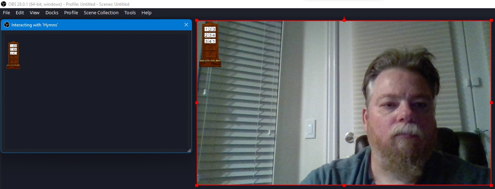
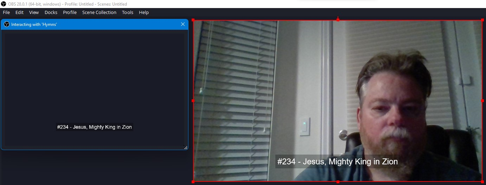
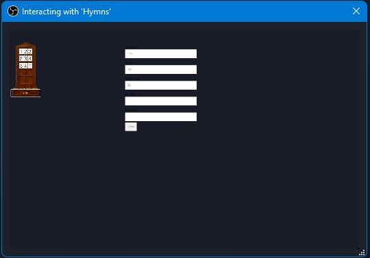

# HymnBoard
A web page as an OBS Studio overlay for displaying the Hymn numbers of a church service and the current hymn number and title

OBS Studio has a Browser overlay.  If you host this project and then point a Browser overlay to it, you can interact with the overlay through a seperate window to set the hymn numbers and hide the bug and show the number and text by clicking on the number in the Bug.

When launched a blank Hymn Board bug is visible, hovering over any blank number row shows a Edit button, when all the rows are populated the card shelf can be clicked on to enable Edit.

