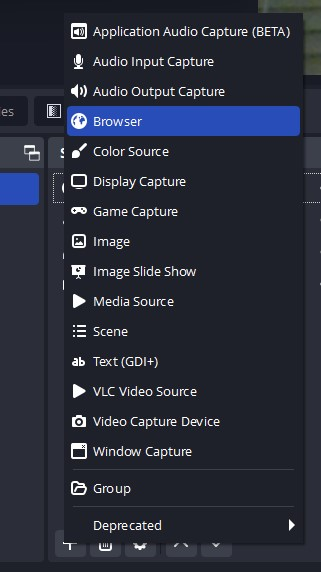
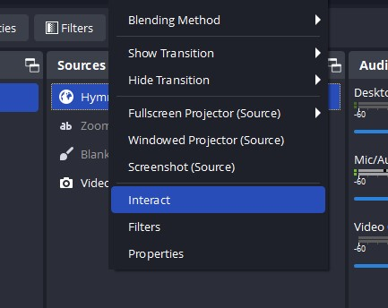
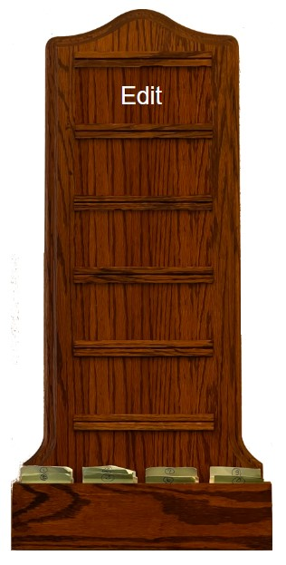
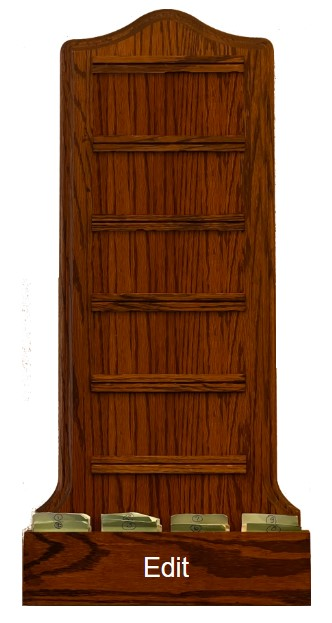
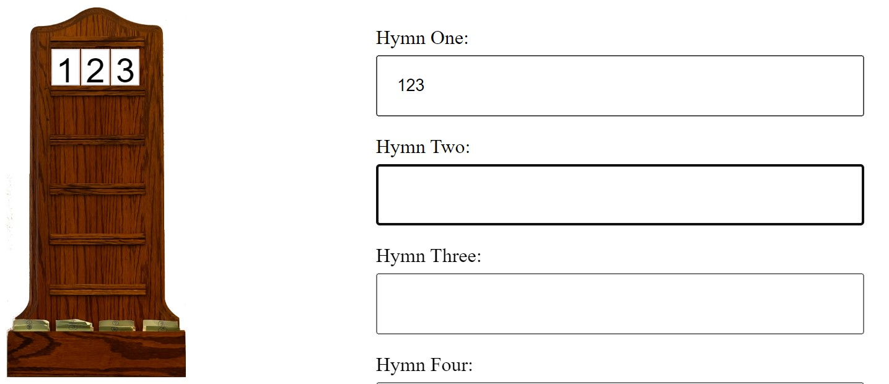
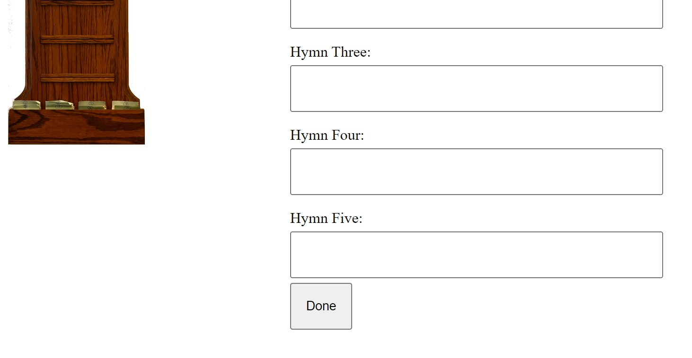
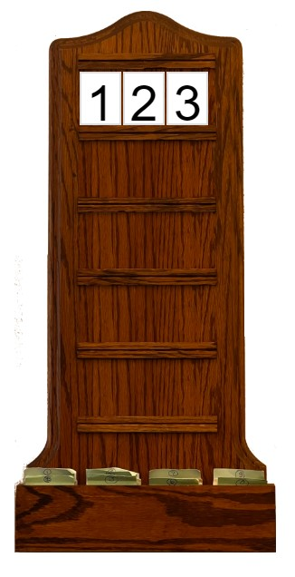

# HymnBoard
A web page as an OBS Studio overlay for displaying the Hymn numbers of a church service and the current hymn number and title

OBS Studio has a Browser overlay.  If you host this project and then point a Browser overlay to it, you can interact with the overlay through a seperate window to set the hymn numbers and hide the bug and show the number and text by clicking on the number in the Bug.

When launched a blank Hymn Board bug is visible, hovering over any blank number row shows a Edit button, when all the rows are populated the card shelf can be clicked on to enable Edit.

Hover to Edit

When full click here to Edit

Type in fields to update Hymn Board

Click Done to hide editor

If you click on a Hymn Number in the Hymn Board the Hymn Board hides and the title of the Hymn is displayed

The title for the Hymn Number you clicked on is displayed, click the title to hide it and display the Bug again.

