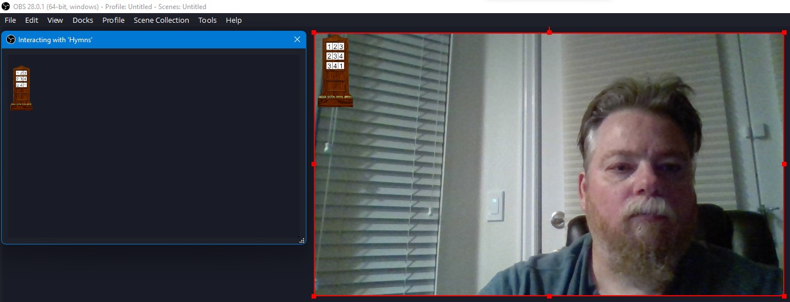
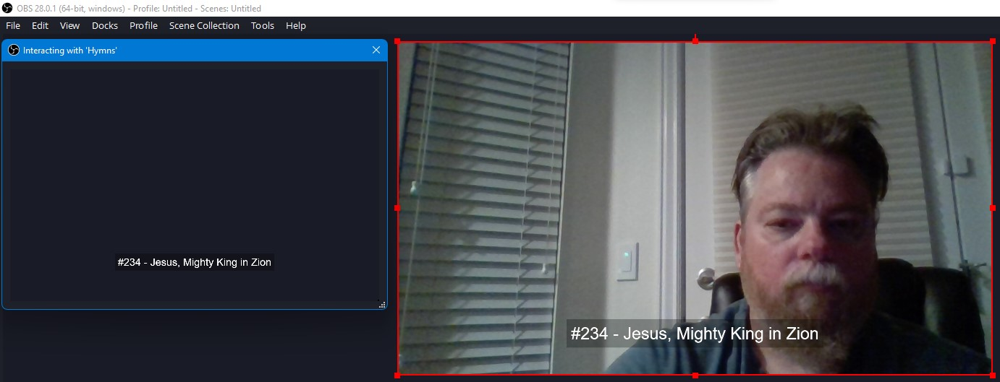
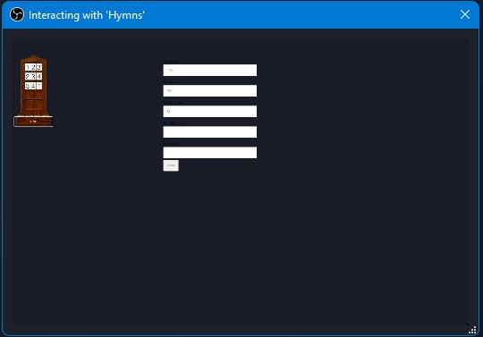
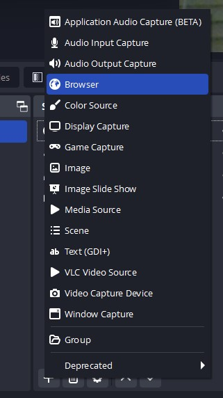
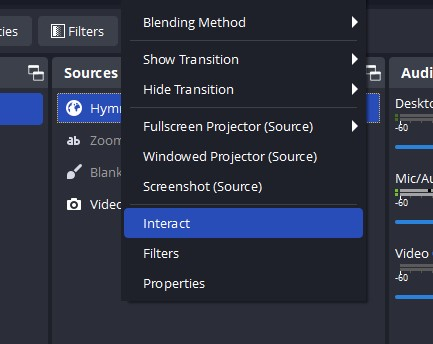
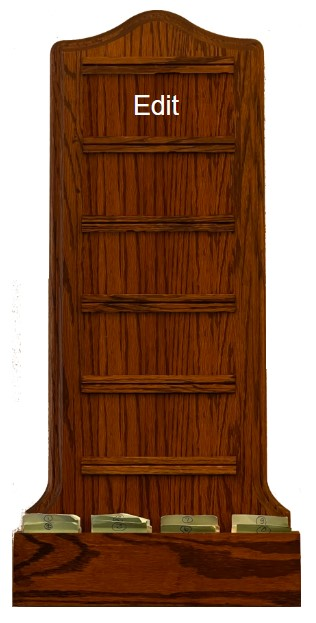
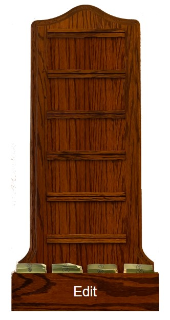
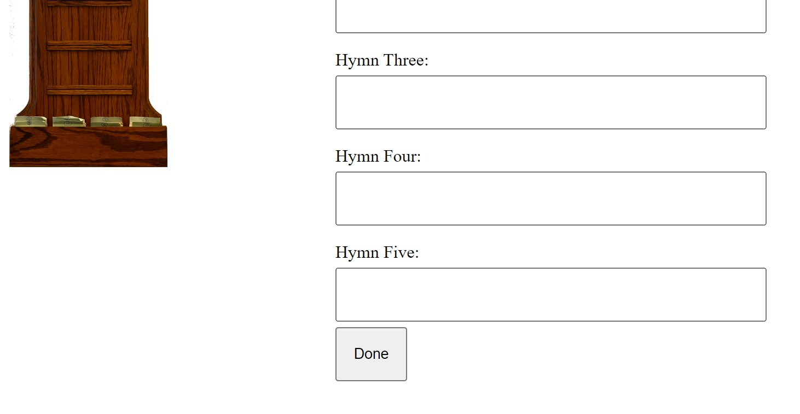
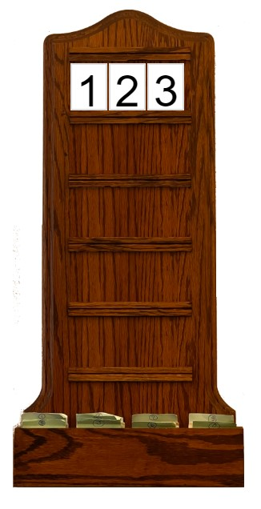
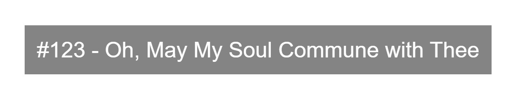

# HymnBoard
## Usage:
A web page as an OBS Studio overlay for displaying the Hymn numbers of a church service and the current hymn number and title

OBS Studio has a Browser overlay.  If you host this project and then point a Browser overlay to it, you can interact with the overlay through a separate window to set the hymn numbers and hide the bug and show the number and text by clicking on the number in the Bug.

When launched a blank Hymn Board bug is visible, right click on overlay in Sources list and pick Interact, this will launch a duplicate of the overlay in a separate window. Any interaction with this separate window will effect the actual overlay in the video. Hovering over any blank number row in the Interact window shows a Edit button, when all the rows are populated the card shelf can be clicked on to enable Edit. Try to complete all your edits before the broadcast/stream begins because the Edit form will be visible in the stream.

Hover to Edit, click Edit

When full click here to Edit

Type in fields to update Hymn Board

Click Done to hide editor

If you click on a Hymn Number in the Hymn Board the Hymn Board hides and the title of the Hymn is displayed

The title for the Hymn Number you clicked on is displayed, click the title to hide it and display the Bug again.

## Installation
git clone https://github.com/losmurfs/HymnBoard

cd HymnBoard

If you don't have Java 18, install it (this is for creating a simple static web server, if you already have one, you can use that instead):

sudo apt-get install openjdk-18-jdk-headless

Start a simple static webserver:

jwebserver

The output of jwebserver will tell you the URL to enter for the OBS Studio Browser Overlay
